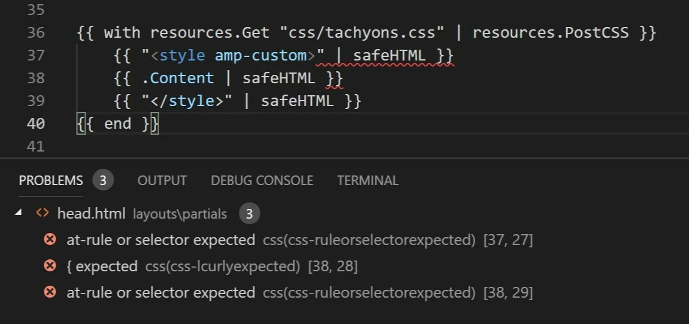

I have been getting this error in VS Code for using `<style>` and then not following it up with a valid CSS.



Using the `htmlUnescape` function to render the style tag and then piping it through `safeHTML` fixes the problem. VS Code does not see anything wrong with the HTML syntax. Because there is no HTML. :smirk:

```html
{{ htmlUnescape "&lt;style amp-custom&gt;" | safeHTML }}
    {{ with resources.Get "css/tachyons.css" | resources.PostCSS }}
    {{ .Content | safeHTML }}
    {{ end }}
{{ htmlUnescape "&lt;/style&gt;" | safeHTML }}
```

Now I can place the style tags outside of the resource generator as well without triggering a template error on build.

Mind..

I am using `safeHTML` pipe on CSS because AMP does not like escaped symbols in `amp-custom`.